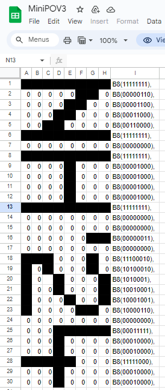
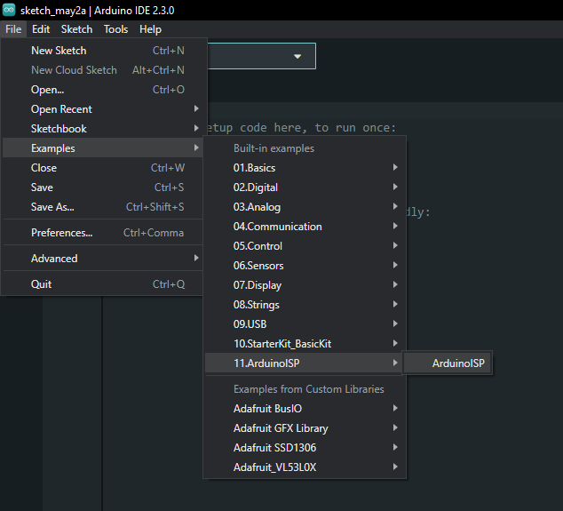
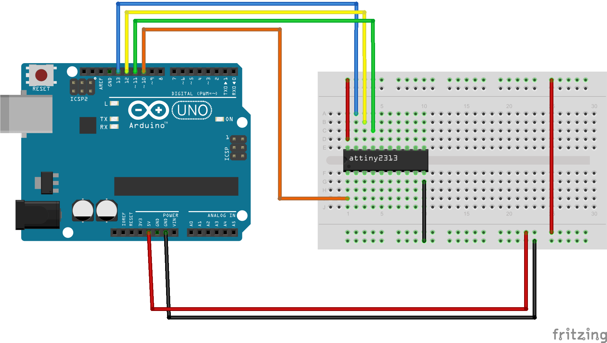
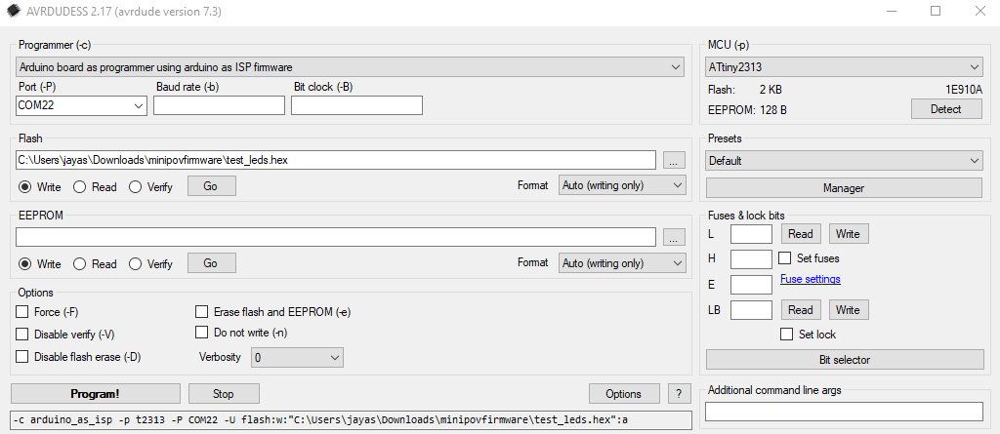

# MiniPOV3 in 2024

This is a short tutorial on how to program your MiniPOV3 in 2024. 

## Requirements 

As far as I can tell this currently only works on Windows 10/11 but will update later if other OSs work. 

### Hardware 

Apart from your MiniPOV3 (with the ATTiny2313) your will also need an AVR based Arduino board to upload it code to it, this example uses an Arduino Uno. 

### Software 
- [WinAVR](https://sourceforge.net/projects/winavr/files/latest/download) & [make](https://gnuwin32.sourceforge.net/packages/make.htm) to build the software 
- [Arduino IDE](https://www.arduino.cc/en/software) to flash your Arduino board with the ArduinoISP firmware 
- [AVRDUDESS](https://github.com/ZakKemble/AVRDUDESS/releases/tag/v2.17) to upload the actual firmware to the ATTiny2313 MCU 


## Steps 

### Create your edit

Start by cloning or downloading this repository, you will find severl C source files. 

In your favourite editor, open `mypov.c`, on line 32 you will find an array variable named `image`, which is assined to a list of binary numbers, thses represent which LEDs are on and off at each segment, with the rightermost bits being the lower LEDs (towards the battery connection), you can sit the bits to 1 or 0 to turn LEDs on or off, and even add more sections to the array. 

Here's a checkerboard pattern. 

```c
const static int image[] = {
  B8(10101010),
  B8(01010101),
  B8(10101010),
  B8(01010101),
  B8(10101010),
  B8(01010101),
  B8(10101010),
  B8(01010101),
  B8(10101010),
  B8(01010101),
  B8(10101010),
  B8(01010101)
};
```

You can use [this Google sheet](https://docs.google.com/spreadsheets/d/1JXRmkcQ_jvdEf_VAuOMeiStR5ttnNMs8VD99YELfGRA/edit#gid=0) that uses custom formatting and formulas that will let you play with setting and unsetting pixels and will give you a list of all the binary numbers down the side which you can copy and paste in. 



### Building 

Open this repository in a command line, with make and WinAVR installed, run `make mypov.hex`, this will compile your code to the file `mypov.hex`.


### Create your uploader 

Connect your AVR based Arduino to your PC, opening the Arduino IDE, select it the correct port and Arduino boardn then open the examplke sketch `File -> Examples -> 11.ArduinoISP -> ArduinoISP` and upload it. 



#### Circuit 

Next, with your ATTiny2313 on a breadboard, connect pin 10 to Arduino ground, and pin 20 to arduino +5 volts. 

For the Arduino Uno, connect: 

- Arduino pin 13 -> ATTiny2313 pin 19
- Arduino pin 12 -> ATTiny2313 pin 18
- Arduino pin 11 -> ATTiny2313 pin 17
- Arduino pin 10 -> ATTiny2313 pin 1



### Upload

Open AVRDUDESS, under `Programmer` select `Arduino board as programmer using arduino as ISP firmware`, select the COM port your Arduino is attached to, then under `MCU` select `ATtiny2313`, then under flash, open the `mypov.hex` hex file we generated earlier, then click `Program!`.




You can now put take the ATTint2313 and put it in your MiniPOV3 and use. 
